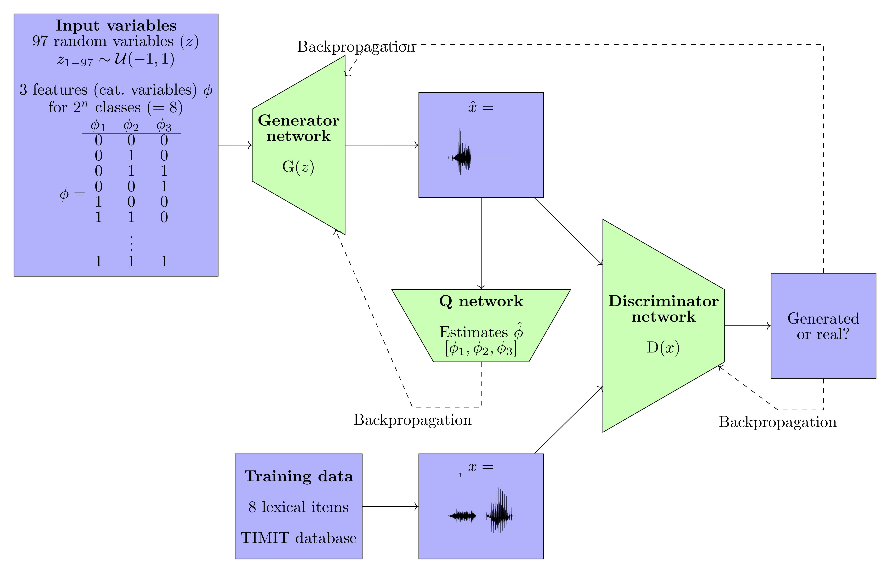
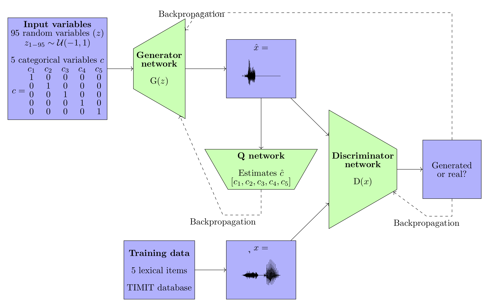

# fiwGAN (Featural InfoWaveGAN): Lexical Learning in Generative Adversarial Phonology

PAPER HERE: https://www.sciencedirect.com/science/article/pii/S0893608021001052

In `fiwGAN.py`. An architecture for modeling lexical learning from raw acoustic inputs called Featural InfoWaveGAN (fiwGAN) that combines Deep Convolutional GAN architecture for audio data (WaveGAN) with categorical variables in information theoretic proposal InfoGAN. Unlike InfoGAN, latent code is distributed binomially and the training is performed with sigmoid cross-entropy. Based on [WaveGAN](https://github.com/chrisdonahue/wavegan) (Donahue et al. 2019) and InfoGAN (Chen et al. 2016), partially also on code by [Rodionov](https://github.com/singnet/semantic-vision/blob/master/experiments/concept_learning/gans/info-wgan-gp/10_originfo_sepQ_v2_lr1e-3/train.py) (2018).




# ciwGAN (Categorical InfoWaveGAN)

An architecture for modeling lexical learning from raw acoustic inputs called Categorical InfoWaveGAN that combines Deep Convolutional GAN architecture for audio data (WaveGAN) with categorical variables in information theoretic proposal InfoGAN. 

Based on WaveGAN (Donahue et al. 2019) (https://github.com/chrisdonahue/wavegan) and WGAN-GP implementation of InfoGAN by Sergey Rodionov (https://github.com/singnet/semantic-vision/blob/master/experiments/concept_learning/gans/info-wgan-gp/10_originfo_sepQ_v2_lr1e-3/train.py). 

In addition to the Generator and the Discriminator networks, the architecture introduces a network that learns to classify generated outputs and forces the Generator to encode lexical information in its latent space. Lexical and semantic encoding is represented with a set of categorical binary variables. The network is trained on five lexical items from TIMIT. The network learns to generate lexical items and encodes the identity of each item in categorical variables of the latent space. By manipulating the categorical variables in the latent space that encode lexical information, the network outputs the five lexical items, suggesting that each lexical item is represented with unique categorical code. Such representation can serve as the basis for lexical and semantic learning from raw acoustic input.  



After 19,244 steps trained on _oily, water, rag, suit_ and _year_ from TIMIT, the network learns to output lexical items based on latent code. The following generated outputs are generated with the following values of c:

1. \[1, 0, 0, 0, 0\]: _suit_
2. \[0, 1, 0, 0, 0\]: _year_
3. \[0, 0, 1, 0, 0\]: _water_
4. \[0, 0, 0, 1, 0\]: _oily_
5. \[0, 0, 0, 0, 1\]: _rag_

[Audio sample 1](http://faculty.washington.edu/begus/files/github19244c_2_5words.wav)
[Audio sample 2](http://faculty.washington.edu/begus/files/github19244c_2_5words.wav)

To change number of categorical latent variables:

```
--num_categ n
```
